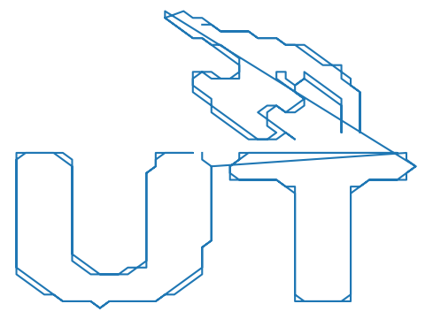
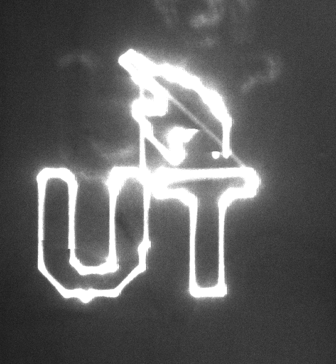
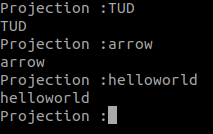
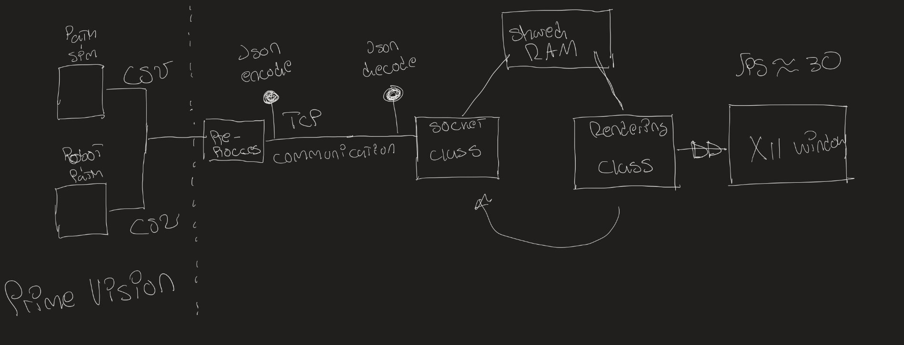
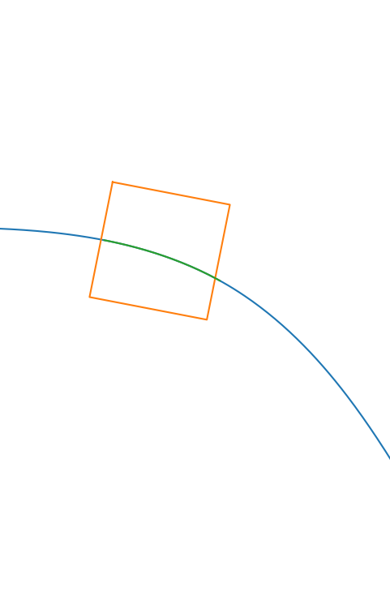
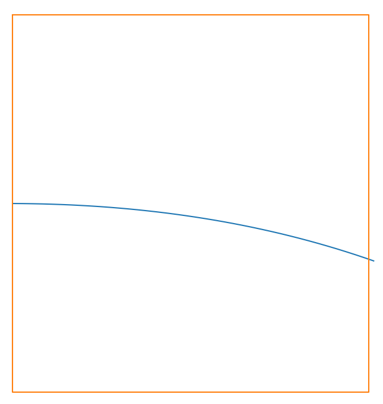

# robot-intention-feedback
HEAD
This repository includes the code used for the bachelor thesis 'robot intention feedback' in the Delft Centre for Systems and Control.

## Introduction
Firmware for the laser/galvo controller.
## Output




Currently there are 5 projections stored on the Arduino M0. The program USBserial.py takes in user input as shown here:

## Getting Started
1. Download / clone code 
2. upload using standard Arduino IDE.
3. Connect with USB cable
4. Start the USBserial python example

## Design Projections
In the Projections.py file we have designed a Circle and HelloWorld projection. In EdgeTrace.py the design process is automated. Simply download an image into this repository and change the name accordingly in the file. We are using the contour detection from open CV. Make sure you pick an image with not too much detail, as the projector can only handle around 150 datapoints. If you need to transform the image you can adjust the parameter THETA accordingly in the script.

When you have designed a projection copy the x-y data into static memory of the microcontroller by simply spawning a C array in Laser_Code_ARM.ino.

## Dependecies
For the USB serial python example you need the pyserial library.
```
pip install pyserial
```
For the EdgeTrace you need the python wrapper for Open CV
```
pip install cv2
```

This repository includes the code usd for the bachelor thesis 'robot intention feedback' in the Delft Centre for Systems and Control.
Documentation for this project can be found here: [Go to the project web site](https://timothans33.github.io/robot-intention-feedback)

Of course you want to get started with this exciting project ASAP. First clone this repository and change to the correct branch
```
git clone https://github.com/TimoThans33/robot-intention-feedback.git
```
```
git checkout DLP-Lightcrafter-2000
```
## Getting started BeagleBone
To run the examples we need to start an X11 server on the BeagleBone Black. On a computer with
a desktop environment this is not necessary. 
```
sudo startx
```
Now you can SSH into the server / host computer passing -X (from the BeagleBone Black)
```
ssh -X username@192.168.7.1
```
Alternatively you can run natively on the BeagleBone black. But this has not been tested thoroughly. In this X server you can start any script you would like. For example a simple QT window.
```
python3 robot-intention-feedback/Qt-examples/example-window.py
```

## Main Program
The goal of the main program is to project slick path's that the robot is following. For a complete description of the main program you should check out the website of this project:
[Go to the project web site](https://timothans33.github.io/robot-intention-feedback)

### Getting started main-program
First install the dependecies.
```
pip install pandas, numpy
sudo apt-get install libjson-dev-c
```
compile the main program with a Makefile.
```
make main-program
```
If you are not connected to a robot you can start the simulation. You do have to pass the correct ip-address and port. For example the localhost: 127.0.0.1.
```
python3 main-sim.py 127.0.0.1 8080
```
You can start rendering and connect to the simulation by passing the same ip-address
and port. This should get you started.
```
./main-program 127.0.0.1 8080
```
### High level example
We have opt to try out our solution in python. It is simulation in which the program reads a csv
file with robot coordinates. Our program then transforms these coordinates to the robot frame and projects the coordinates up to 1 meter in fron of the robot. Running this program will give you an idea of what path the robot will follow.

```
python3 plot-path.py
```
### Main Program Architecture

This is briefly the software architecture. But again I would refer you to the project website.
[Go to the project web site](https://timothans33.github.io/robot-intention-feedback)

## Other Examples
X11 User Interface made with QT. The idea is to run the UI code on a server or Jetson TX2. The UI is projected by the DLP Lightcrafter 2000 by making use of the X11 protocol.

### Dependecies
On server (host computer)
```
pip install PyQt5
```
```
sudo apt=-get install pyqt5-dev-tools
```
On the client a.k.a BeagleBone Black (assuming we are running Debian without desktop interface) we have to install a bunch of dependecies.
```
sudo apt install xorg
```
According to Qt for Debian-base GNU/Linux systems we need to install a bunch of drivers. Some might already be have been installed some not. Just run the shell script I included.
```
./QtInstallDependecies.sh
```
### Qt-support
For typical user interfaces we can utilize Qt. The python samples can be started using:
```
python3 image-window.py
``` 
The cpp examples you can use qmake from Qt. I have created the .pro file.
```
qmake Qt-example.pro
```
This will update the makefile. Then you can simply
```
make
```
This will create a run script
```
./Qt-example
```
For some reason the Qt windows that are created on and shown on the projector have a lot of lag and crash all te time. I am not sure why this is.

### X-windows support
X-windows is the GUI driver closest to the linux kernel. It is a bit of a pain to program in, but it is much more reliable and faster on embedded devices like our BeagleBone Black. For convenience I made a small make file. Simply in the repository do
```
make
```
```
./X-example
```
### OpenGL support
OpenGL is an API for making fancy graphics. It consists of a complex pipeline that makes efficient use of the CPU and GPU on the host computer. For the examples I have used the X-windows drivers as this was much more reliable.
```
make openGL-example
```
```
./openGL-example
```

HEAD
HEAD
f844b777da67f8bca5f9ced71b111f127dac81b6

## Robot-simulation
With the robot-simulation files we can simulate a trajectory of the robot without actually installing the projector on the robot.



b29aa57c7e8b285721b0b74fde9da84f74ac8c61
c0e7be52d98622b781703c6d826e3c6059abe97a
